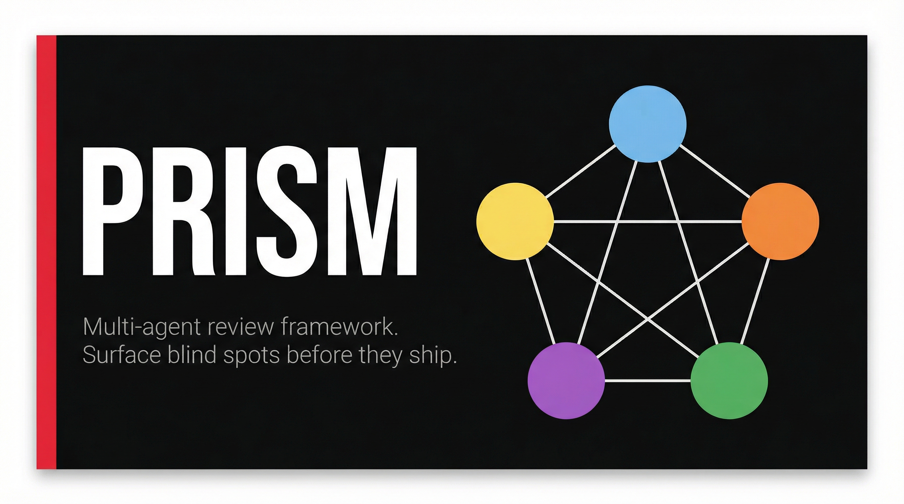
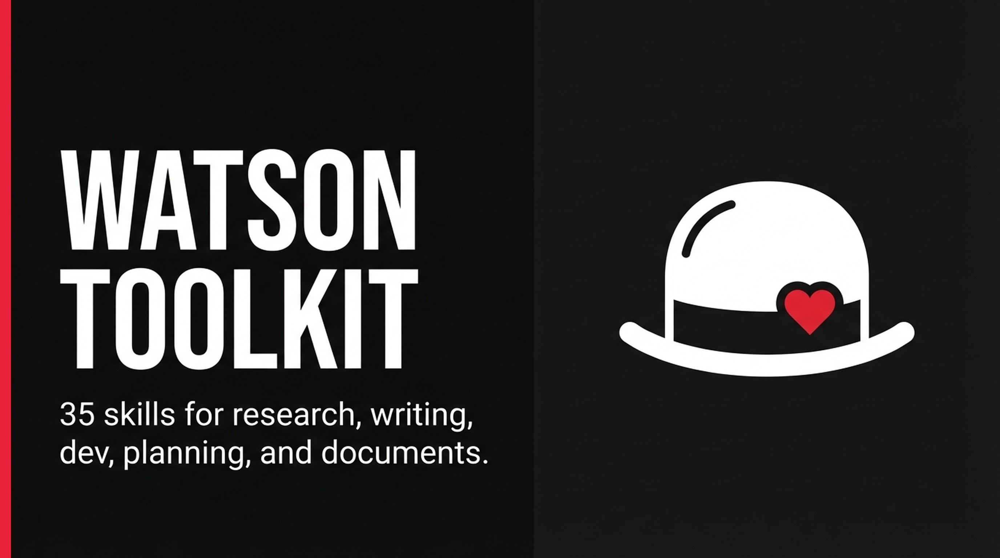
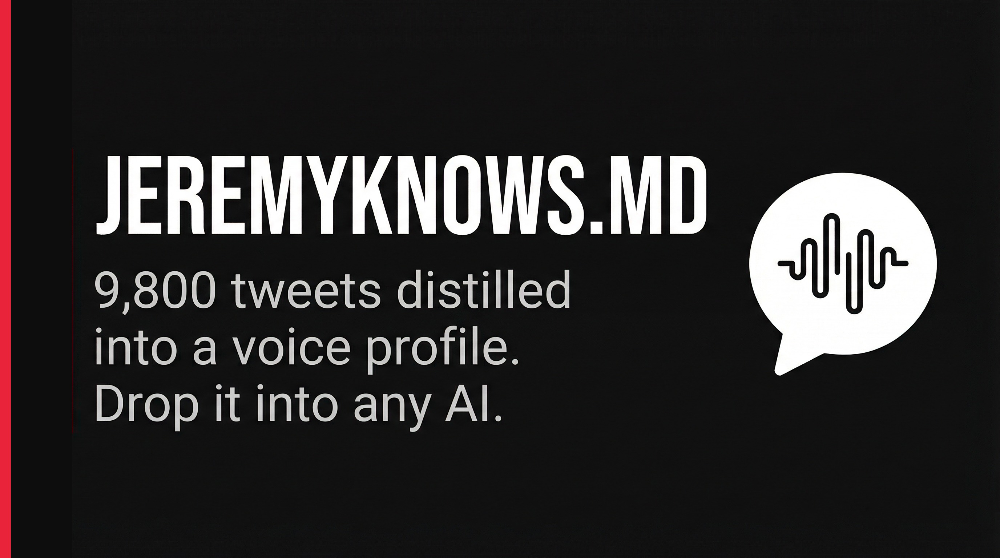
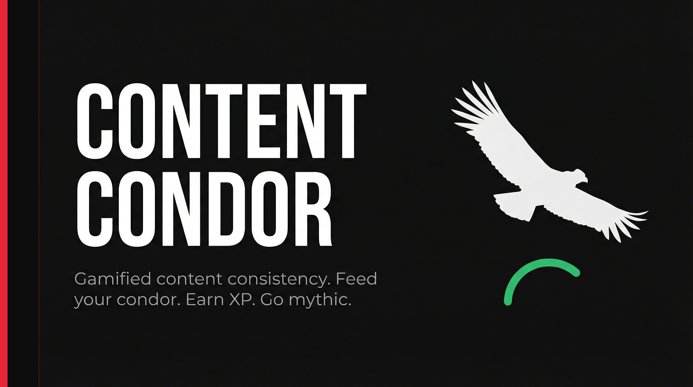

# Hey, I'm Jeremy Knows

But what does Jeremy Knows know? I often say, "just enough to be dangerous."

I make complex things easy to understand for people. That's it. That's the whole job.

I was an actor, then clown, improviser, and puppeteer, then teacher and director.
In 2020, Covid shut down my industry full stop so I pivoted to photography and handyman work to pay the bills in NYC.
In 2021, I discovered blockchain, crypto, and NFTs. Then through a series of delusional sprints I built a following and landed my dream job.
Since 2023, I serve as Community Success Analyst to Gary Vaynerchuk's [VeeFriends](https://github.com/veefriends).

Now I host livestreams, advise on Web3 strategy, and lead community and concierge for VeeFriends.
Oh, and thanks to agentic tools, I can now express my creativity digitally and can't get enough.

Different context, same skills. Nice to meet you.

---

## What I do

I'm **Community Success Analyst** at **[VeeFriends](https://veefriends.com)**, Gary Vaynerchuk's IP and community platform.

My job is to take complicated things, wallets, crypto, product drops, customer support, and make them work for real people at scale.

The teacher background isn't a footnote. It's the operating system. Everything I build is designed to be understood, not just used.

---

## What I build

I build things I wish existed. Most of it is internal ops infrastructure. Some of it ships publicly. All of it is real.

**AI agent infrastructure**

- **Watson** — my AI COO. A multi-agent swarm running on [OpenClaw](https://github.com/jeremyknows/openclaw): event bus, memory system, scheduler, specialist agents for KB management, task routing, content production, market intelligence, and analytics. Has been running continuously for months. Not a demo.
- **Watson-OS** — the local ops dashboard that surfaces everything Watson touches. Agent panels, cron health, memory explorer, event bus viewer, system vitals. Next.js + SQLite. Runs on my machine.
- **[ClawStarter](https://github.com/jeremyknows/clawstarter)** — `curl | bash` installer that gets a non-technical person from zero to a running AI agent on macOS or Linux. Built because onboarding friction kills adoption.
- **[OpenClaw](https://github.com/jeremyknows/openclaw)** — the open-source AI agent platform Watson runs on. I contribute skills, patterns, and infrastructure from running it in production.
- **[Watson Works](https://github.com/jeremyknows/watson-works)** — a blog written in Watson's voice about building real agent infrastructure. What works, what breaks, what the architecture actually looks like.

**VeeFriends tools** *(mostly private, but real)*

- **VeeFriends Ops Hub** — internal dashboard linking 5+ sub-apps: S2 upgrades, Treasure Chest planning, VF analytics, community programs. Central coordination layer for product launches.
- **VeeFriends Analytics** — on-chain dashboards for NFT P&L, wallet filtering, holder retention metrics. Dune SQL + custom queries. Private.
- **VeeFriends Market Pulse** — eBay sold data scraper and pricing intelligence. Weekly trends, secondary market visibility, alerts. Private.
- **DoDo** — VeeFriends knowledge base. Full RAG pipeline, 263+ entities, 7 domain files, two-track intake system, confidence engine. Powers a fan-facing companion agent in the community Discord.
- **Content Condor** — gamified content consistency app. Post across platforms, feed your virtual condor, earn XP, evolve from egg to mythic creator. Built because motivation systems shouldn't be boring. Beta: [watsonwillknow@gmail.com](mailto:watsonwillknow@gmail.com)
- **[VF Global Wallet Skill](https://github.com/jeremyknows/vf-global-wallet-skill)** — Claude skill for integrating VeeFriends Global Wallet via Privy cross-app wallets.

**Utilities and experiments**

- **[discrawl](https://github.com/jeremyknows/discrawl)** — CLI for Discord with a SQLite backend. Query your server history like a database.
- **[decide](https://github.com/jeremyknows/decide)** — lightweight decision-flow tool.
- **[x-bookmark-triage](https://github.com/jeremyknows/x-bookmark-triage)** — turns X/Twitter bookmarks into structured knowledge cards posted to Discord. Built because bookmarks are where good ideas go to die.
- **[generate-jsdoc](https://github.com/jeremyknows/generate-jsdoc)** — auto-generate JSDoc from source.
- **[claude-context-audit](https://github.com/jeremyknows/claude-context-audit)** — audit tool for Claude context windows.

---

## Open source

### For OpenClaw builders

- **[Skill Doctor](https://github.com/jeremyknows/skill-doctor)** + **[Publish Skills](https://github.com/jeremyknows/publish-skills)** — build a skill, audit it with a 14-question health checklist, ship it spec-compliant.
- **[Sprint](https://github.com/jeremyknows/openclaw-sprint)** — autonomous deep-work sessions. Set a topic, set a duration, walk away. Proven across overnight runs.
- **[x-master](https://github.com/jeremyknows/x-master)** — master routing skill for all X/Twitter operations in an agent.
- **[deep-research](https://github.com/jeremyknows/deep-research)** — 7-stage structured research protocol for defensible briefs.
- **[update-docs](https://github.com/jeremyknows/update-docs)** — generate and maintain architecture docs for any codebase.

A few things I've shipped that you can actually use:

&nbsp;

&nbsp;

→ [See everything on GitHub](https://github.com/jeremyknows)

---

## How I think about AI

I'm not a developer by background, but I ship with AI every day.

Here's what I've actually learned from doing it: the bottleneck was never the technology. It was always the operator who understood the domain. Once you stop asking "what can AI do?" and start asking "what's now possible in *my specific context* that wasn't before?" — that's when it gets interesting.

I write about this. I build it publicly. If you're figuring out how to actually use this stuff, not just talk about it, you're in the right place.

---

## VeeFriends

If you're here from the community, hi.

VeeFriends is a character IP and community built around Gary Vaynerchuk's 283 original characters. We do trading cards, comics, live events, and education. It's one of the most interesting experiments in what community actually means in a digital-native world.

I've been here since mint in May of 2021, and working full time for the company since February 2023, the community operations, the events, the holder support, the behind-the-scenes. If you want that view, follow along.

- [VeeFriends.com](https://veefriends.com)
- [@VeeFriends on X](https://x.com/veefriends)

---

## Find me

- X: [@jeremyknows](https://x.com/jeremyknows)
- Discord: jeremyknows (in the VeeFriends server)
- Working on something interesting? [Let's talk.](https://x.com/jeremyknows)

---

## Why "Jeremy Knows"

Clown. Teacher. Community leader. Agentic Engineer. Same person, different rooms.

I know enough to be dangerous, curious enough to go deep on anything, grounded enough to ship before it's perfect and share the process of making a real impact.

---

*Built with Watson 🎩*
